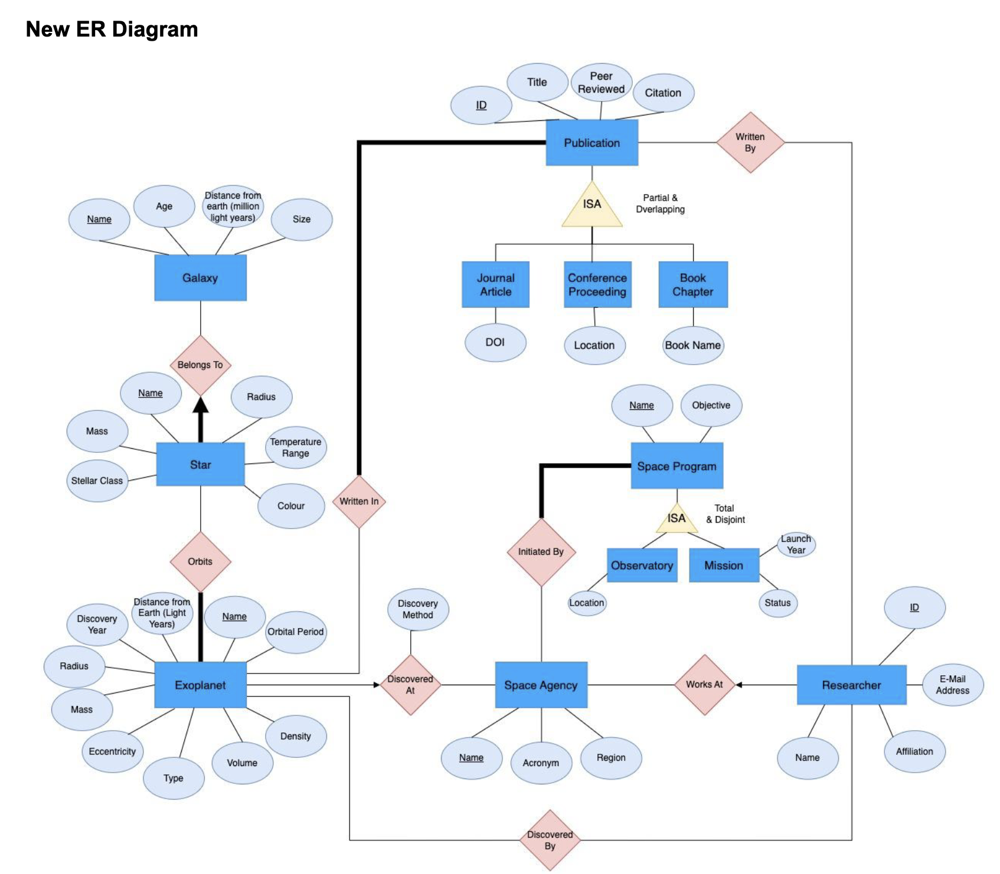

# 🪐 Exoplanet Exploration System

## 🌐 Website  

https://exoplanet-explorer-system.onrender.com

## 👥 Original Team Members (UBC CPSC304 Project)
- Jaiveer Tiwana
- Saumya Jain  
- Rishavpreet Singh  

## 🛠️ Current Maintainer & Ongoing Expansion  
Originally created as a course project but I am no actively expanding on it. The backend has been migrated from Oracle SQL to **SQLite**, and the system has been adapted for public deployment beyond UBC infrastructure. Future goals include UI enhancements, expanded data sets, and interactive query features.

---

## 🚀 Project Summary

The Exoplanet Exploration System is a full-stack web application and relational database designed to model, analyze, and query detailed information about:

- Exoplanets  
- Host Stars  
- Galaxies  
- Space Agencies and Programs  
- Scientific Missions and Publications  
- Contributing Researchers

It simulates a real-world scientific database supporting complex queries, data exploration, and academic research.

---

## 🔭 Domain Context

**Exoplanets** are planets orbiting stars beyond our solar system. Their discovery and study involve collaborative efforts by global space agencies, researchers, and missions. This system organizes this data into a relational model to support meaningful exploration and analysis.

---

## 🧩 Key Features

- **Rich Relational Schema** with 20+ interrelated tables.
- **3NF Normalization** for data integrity and minimized redundancy.
- **ISA Hierarchies** to distinguish Missions and Observatories.
- **Foreign Keys & Participation Constraints** for real-world integrity enforcement.
- **Realistic Example Data** including Proxima Centauri b, NASA, ESA, and JWST.
- **PHP Frontend** with SQL-backed operations: insert, delete, update, view, and query — no manual SQL required.
- **SQLite Migration**: Originally powered by Oracle, now portable using SQLite for local and public hosting.

---

## 🧬 ER Diagram

  

---

## 💡 Use Cases

- Compare properties of exoplanets across different systems.
- Trace discovery contributions by specific researchers or agencies.
- Review space programs and their related missions and observatories.
- Access and analyze scientific publications tied to individual exoplanets.

---

## ⚙️ Technology Stack

| Layer      | Tech               |
|------------|--------------------|
| Database   | SQLite (originally Oracle SQL) |
| Backend    | PHP                |
| Frontend   | HTML / CSS / PHP   |

---

## 🧪 Example Features on the Frontend

- View and filter exoplanet entries
- Add or remove space agencies
- Modify researcher records
- Display publications linked to discoveries
- Auto-refresh after operations with status feedback

---

## 📂 Running Locally

1. Clone this repo  
2. Set up a PHP server (e.g. using XAMPP or built-in PHP dev server)  
3. Ensure SQLite is enabled and database file is correctly referenced  
4. Run `exoplanet-explorer.php` in your browser  

---

